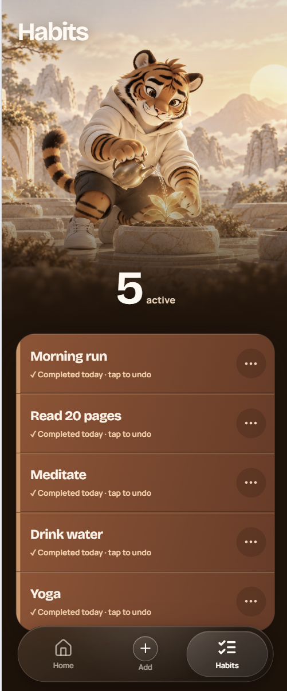

# Tora Habit Tracker

A simple habit tracker with a calm, friendly design. Tora, the tiger guide, helps you see your daily progress, keep your streak, and finish your habits one by one.

## New look

The app now has a warmer and more focused UI. The home page shows your daily progress, current streak, personal best, and the next habit to complete. The habit page gives you a clear view of every habit.

<p align="center">
  
  
</p>

## What you can do

- Tap a habit to check it in.
- Tap it again to undo the check-in.
- Add, rename, and delete habits.
- See completed habits with a stronger color difference.
- Keep the habit list open on the home page.
- Watch a small celebration when every habit is done.
- Use the app on mobile or desktop.

The home check-in button uses an orange crystal style. When all habits are complete, it changes to beige so the finished state is easy to notice.

## Run the app

You only need Docker Desktop. Python and Node.js do not need to be installed on your computer.

```bash
docker compose up --build
```

Then open:

- App: [http://localhost:3000](http://localhost:3000)
- Backend API: [http://localhost:8000](http://localhost:8000)

The first start creates the database and adds demo habits automatically. Your data stays in the Docker volume when the app stops.

To stop the app, press `Ctrl+C`, then run:

```bash
docker compose down
```

## Tech stack

- Next.js and TypeScript for the frontend
- FastAPI and SQLAlchemy for the backend
- PostgreSQL for saved data
- Redis for cache and short-lived data
- Alembic for database migrations
- Docker Compose for local setup

## Project structure

```text
frontend/   Next.js app and UI
backend/    FastAPI routes, database code, and tests
docs/       README images
docker-compose.yml
```

The frontend sends API requests through `/api`, and Next.js forwards them to the backend container. This keeps the same setup working across the full Docker stack.
